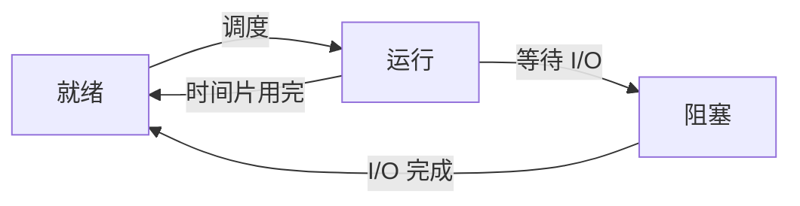

# 笔记编写与绘图规范

## 核心原则

> **Mermaid 负责关系，ASCII 负责状态。**

图的目标是帮助理解机器行为，而不是追求形式统一。能用一个小图说清楚时，不画覆盖整章的巨型关系图。

## 选择图形

| 场景 | 首选 | 重点表达 |
| --- | --- | --- |
| 顺序表、数组、栈、队列 | ASCII | 下标、连续存储、有效元素和边界位置 |
| 链表操作 | ASCII | 指针当前值和每条语句执行后的变化 |
| 递归执行 | ASCII＋Mermaid | Mermaid表示调用关系，ASCII表示调用栈帧 |
| 树和图的结构 | Mermaid | 结点关系和边 |
| 算法控制流程 | Mermaid `flowchart` | 判断、循环和分支关系 |
| 进程状态转换 | Mermaid `stateDiagram-v2` 或 `flowchart` | 状态及触发转换的事件 |
| 协议交互 | Mermaid `sequenceDiagram` | 通信双方、时间顺序和报文字段 |
| Cache、页表和地址划分 | ASCII优先 | 位段、索引、标记和逐级地址转换 |
| CPU数据通路 | Mermaid＋分步ASCII | 部件连接与某条指令在各阶段的实际数据 |

## ASCII规范

ASCII图应放入 `text` 代码块，保证空格和换行不被Markdown折叠。

```text
下标       0       1       2       3
       +-------+-------+-------+-------+
data   |  10   |  20   |  30   |       |
       +-------+-------+-------+-------+
           ^                       ^
         front                   rear
```

绘制时遵守：

1. 标出下标、地址、指针名或寄存器名，避免只有无名称的格子。
2. 操作涉及状态改变时，至少给出“执行前”和“执行后”。
3. 多条语句依次改变状态时，按语句拆图，不把最终结果冒充执行过程。
4. 指明约定，例如 `rear` 指向队尾元素还是下一个可插入位置。
5. 中英文混排可能因渲染字体产生宽度差异；关键对齐处优先使用短英文标识或数字。

## Mermaid规范

Mermaid直接嵌入Markdown，不默认创建独立的 `.mmd` 或 `.mermaid` 文件。

````markdown

````

绘制时遵守：

1. 结点ID使用简短英文，显示文字放在 `[]` 中。
2. 边上写触发条件、操作或实际传输内容。
3. 协议图必须标出重要字段，例如 `seq`、`ack`、标志位和数据长度。
4. 流程图只表示控制关系；若考点涉及内存、队列或寄存器变化，下面必须补ASCII状态图或状态表。
5. 一张图只解决一个主要问题；边过多或需要频繁交叉时拆图。
6. 优先使用GitHub常见、简单的Mermaid语法，避免依赖特殊主题、插件或外部渲染配置。

## 动态过程的标准组织

涉及指针修改、地址转换、指令执行、进程调度或网络传输时，按以下顺序记录：

1. **初始状态**：列出已知变量、地址、寄存器、队列或报文字段。
2. **执行动作**：给出当前执行的代码、指令、事件或收到的报文。
3. **状态变化**：展示哪些值发生变化，哪些值保持不变。
4. **最终结果**：给出机器当前可观察到的状态。
5. **408抽象**：说明题目通常隐藏、简化或重点考查哪一步。

## 图与文字的关系

- 图不能代替条件说明：容量、指针约定、初始序号等必须明确写出。
- 文字不重复朗读图，而应解释图中不明显的因果关系。
- 代码负责定义操作，图负责展示操作造成的状态变化。
- Linux实操输出较长时，只保留与考点有关的行，并注明省略内容。
